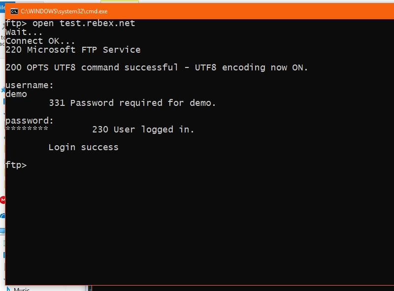
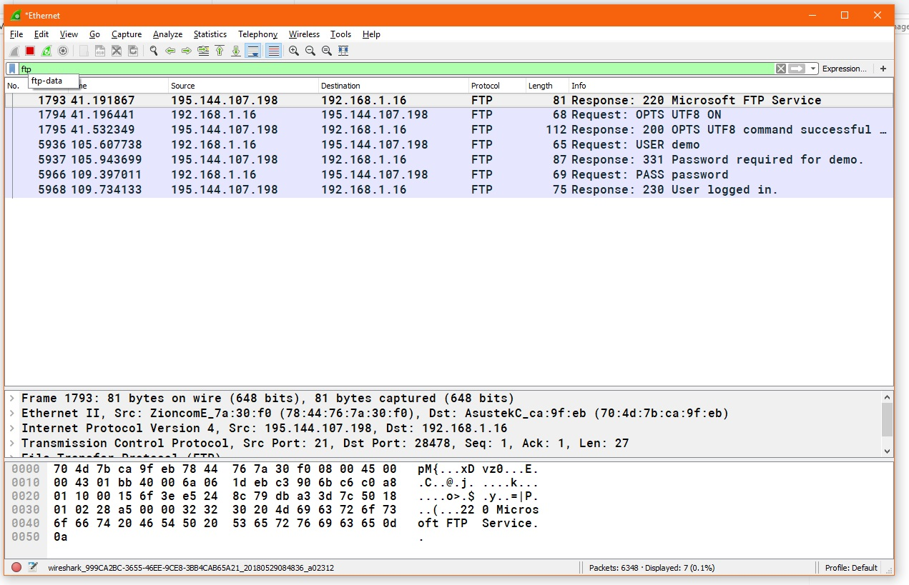
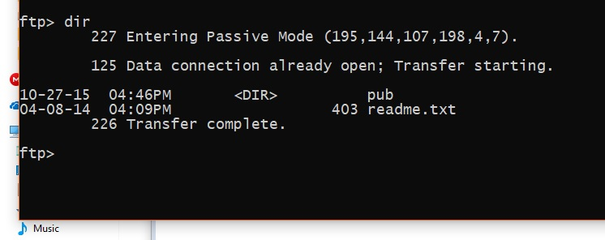
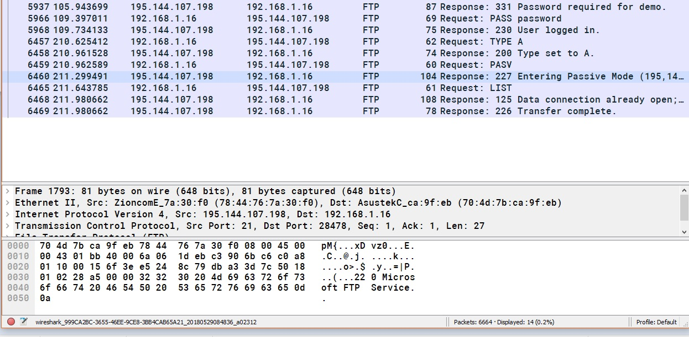
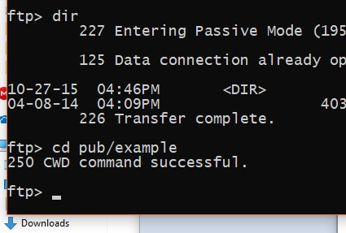
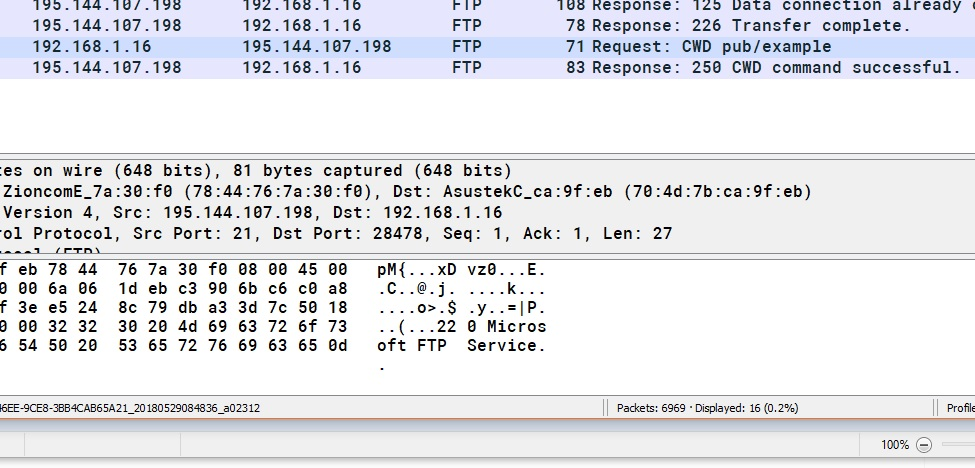
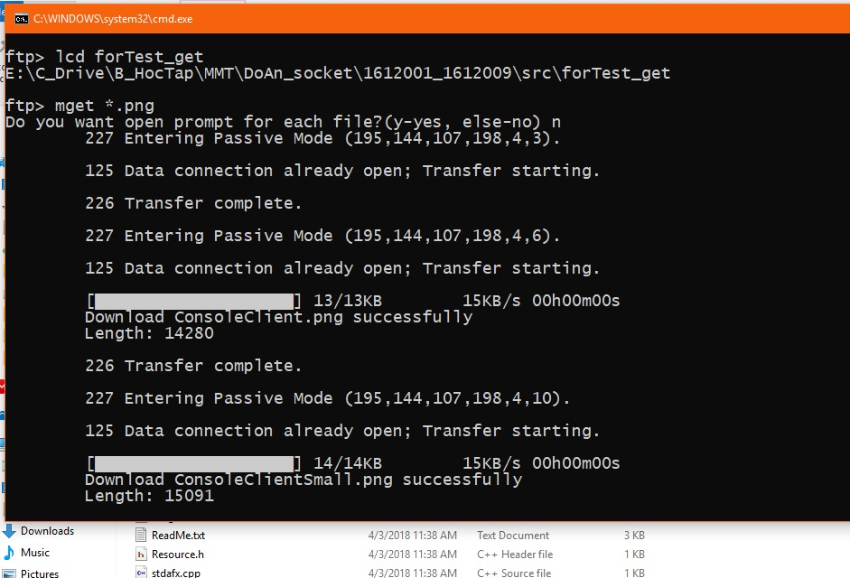
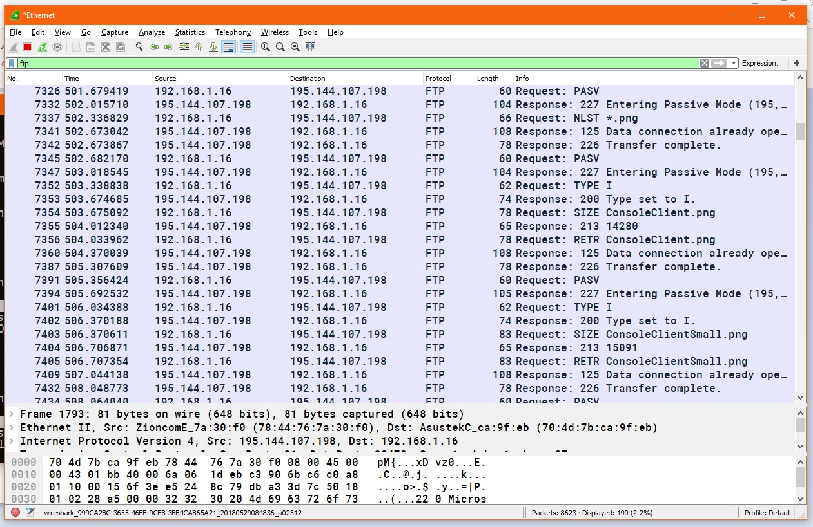
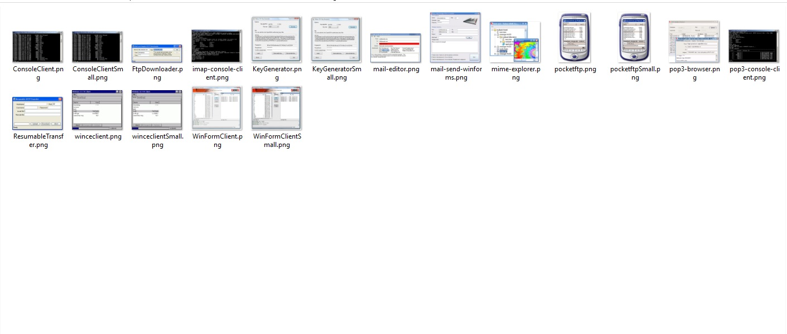

# <center> BÁO CÁO ĐỒ ÁN </center>
<div style="float: right">

[Github](https://github.com/beohoang98/DoAn_FTPClient_Cpp)

</div>

## <center>VIẾT CHƯƠNG TRÌNH FTP</center>

## HĐH: Windows 10

### TRÊN: Console
### IDE: Visual Studio 2013

---

## THÀNH VIÊN

Tên 			| MSSV		| Github
---				|---		|---
Hoàng Dân An 	| 1612001 	|[beohoang98](https://github.com/beohoang98)
Nguyễn Phước An | 1612009 	|[phuocantd](https://github.com/phuocantd)

## PHÂN CHIA CÔNG VIỆC

STT		|	CÔNG VIỆC							| Người đảm nhiệm
---:	|---									|---
1		|Thiết kế flow chương trình chính 		|Dân An
2		|Thiết kế OOP cho chương trình			|Dân An
3		|Tạo các hàm xử lý giao thức cơ bản		|Dân An
4		|Phân chia thư mục và project			|Phước An
5		|Viết các hàm cd, lcd, pwd, mdelete, mkdir, rmdir, quit, exit | Phước An
6		|Viết hàm xử lý mở port, active, passive |Dân An
7		|Viết các hàm put, mput					|Phước An
8		|Viết các hàm get, mget					|Dân An
9		|Viết câu lệnh help và description cho các câu lệnh ftp | Cả hai
10		|Quản lý mã nguồn						|Dân An
11		|Phụ trách document						|Cả hai
12		|Phụ trách ngoại giao (*tham khảo ý tưởng team khác*) |Phước An
13		|Test lỗi và tìm bug					|Phước An

## ĐÁNH GIÁ MỨC ĐỘ HOÀN THÀNH

STT		|	Chức năng					| Hoàn thành
--:		|---							|---:
1		|Kết nối và login đến server	|1
2		|Xử lý đầy đủ các câu lệnh		|1
3		|Câu lệnh ls, dir				|1
4		|Câu lệnh cd, lcd, pwd			|1
5		|put							|1
6		|mput							|1
7		|get							|1
8		|mget							|1
9		|del							|1
10		|mdel							|1
11		|mkdir							|1
12		|rmdir							|1
13		|Cơ chế passive					|1
14		|Cơ chế active (LAN)			|1
15		|Cơ chế active (WAN)			|0
|**Tổng**|**93%**

\newpage

## BÁO CÁO CÁC HÀM VÀ CẤU TRÚC CHƯƠNG TRÌNH

---

<center> **MỤC LỤC** </center>

1. [CẤU TRÚC CHƯƠNG TRÌNH](#main-struct)
2. [DANH SÁCH LỆNH](#list-cmd)
3. [CÁC HẰNG SỐ](#list-const)
4. [CẤU TRÚC CLASS `EPTIPI`](#class-struct)
5. [SCREENSHOTS VÀ THEO DÕI GÓI TIN BẰNG WIRESHARK](#screenshots)

---

<a name="main-struct"></a> 

### 1. CẤU TRÚC CHƯƠNG TRÌNH 
	
1. Khởi tạo kết nối server với địa chỉ từ arguments, hoặc từ lệnh open
2. Gọi hàm login để người dùng login vào, lặp lại đến khi login thành công
3. Đọc lệnh từ bàn phím của người dùng
4. Xử lý lệnh người dùng và gọi hàm đã viết
5. Lặp về Bước 3

<a name="list-cmd"></a>

### 2. DANH SÁCH LỆNH

Các câu lệnh của chương trình (`dir`, `ls`, ...) được lưu trong một `std::map listCmd` kèm với `struct cmpDescription` là các thông tin chi tiết về lệnh đó

- Key của `listCmd` là kiểu chuỗi, là câu lệnh.
- Value của `listCmd` là một `struct` gồm syntax câu lệnh (`title`) và thông tin chi tiết (`description`)

Các lệnh bao gồm

- `open`
- `ls` hoặc `ls [path]`
- `dir` hoặc `dir [path]`
- `cd [path]`
- `pwd`
- `lcd [path]`
- `lls`
- `ldir`
- `get [path]`
- `mget [expression]`
- `put [path]`
- `mput [expression]`
- `del [path]`
- `mdel [expression]`
- `mkdir [name]`
- `rmdir [name]`
- `help [cmd name]` hoặc `help`
- `bye`
- `disconnect`
- `quit`

Chi tiết hơn tại **[đây](./EptipiDocumemt.md#listCmd)**

\newpage

<a name="list-const"></a>

### 3. CÁC HẰNG SỐ

1. **Các status code**
	Các status code được lưu trong `enum FTPCode`

	VD: `LOGIN_SUCCESS = 230`, `OPEN_DATA_CONNECT = 150`, ...

2. **Hằng số trạng thái mở port** <a name="FTPDataMode"></a>
	Bao gồm active và passive
	
	Là các `const int` được define bên trong **namespace** FTPDataMode

	- `FTPDataMode::PASSIVE = 0`
	- `FTPDataMode::ACTIVE = 1`
	- `FTPDataMode::DEFAULT = PASSIVE` (Mặc định là passive)

3. **Hằng số trạng thái truyền dữ liệu** <a name="FTPFileMode"></a>
	Bao gồm mode ASCII (truyền những file text) và mode BINARY (truyền những file nhị phân)

	Định nghĩa trong **namespace** FTPFileMode

	- `FTPFileMode::ASCII` và `FTPFileMode::BINARY`
	- Mặc định `FTPFileMode::DEFAULT = FTPFileMode::BINARY`

---

\newpage

<a name="class-struct"></a>

### 4. CẤU TRÚC CLASS EPTIPI 

Dùng để xử lý các câu lệnh và các giao thức ftp nhanh hơn

Chứa thông tin socket kết nối đến server

Xử lý các hàm nhận vào từ người dùng (`'ls', 'dir', 'get'`, ...)

[Chi tiết về class Eptipi](./EptipiDocument.md)

---

**BIẾN DỮ LIỆU**

### `std::wstring server_addr`

Lưu địa chỉ server dưới dạng IP

### `std::string client_addr`

Lưu địa chỉ client để sử dụng cho mode Active

### `std::string returnStr`

Lưu chuỗi trả về từ server

### `int returnCode`

Lưu return code trả về từ server
Mặc định là -1

### `int returnPort`

Lưu port trả về từ server (nếu có)
Mặc định là -1

### `UCHAR dataMode`

Lưu trạng thái mở data connect là passive hay active
Mặc định là [`FTPDataMode`](#FTPDataMode)`::PASSIVE`

### `UCHAR fileMode`

Lưu trạng thái truyền dữ liệu là Binary hay ASCII
Mặc định là [`FTPFileMode`](#FTPFileMode)`::BINARY`

---

**CÁC HÀM XỬ LÝ**

### **bool** ```Eptipi::handleCmd(std::string cmd)```
	
Xử lý chuỗi lệnh ```cmd``` truyền vào

### **void** `Eptipi::connect(const wchar_t *)`

Kết nối đến chuỗi địa chỉ server truyền vào, nếu không throw exception ra

### **bool** `Eptipi::login()`

Tạo prompt đăng nhặp trên màn hình console

Nếu đăng nhập không thành công, hàm trả về **false** 

---

**CÁC HÀM NỀN**

### `void sendCmd(std::string)`

Gửi lệnh thuần ftp lên server

VD:

```cpp
	sendCmd("LIST\r\n");
```

### `void receiveStatus()`

Nhận về 1 return status từ server, sau đó cắt các thông tin cần thiết lưu về các biến

Sử dụng sau khi thực hiện lệnh `sendCmd()`

VD:

- Server trả về `220 Welcome ...`

	- Hàm cắt ra 220 và lưu vào `returnCode`
	- Chuỗi trả về lưu vào `returnStr`

- Server trả về `227 Passive mode (15,10,19,97,69,69)`

	- Chuỗi trả về sẽ lưu vào `returnStr`
	- Status code `227` sẽ lưu vào `returnCode`
	- Port server trả về bao gồm `15.10.19.97` lưu vào `server_addr` và 69*256 + 69 = 17733 sẽ lưu vào `returnPort`

### `CSocket * openPassiveAndConnect()`

Mở data connection đến server theo mode Passive

Trả về CSocket đã kết nối

### `CSocket * openActiveAndConnect()`

Mở data connection đến server theo mode Active

Trả về CSocket đã Listen, đợi Accept sau.

### `void openDataPort(bool (*before)(CallbackParam &cb), bool (*after)(CallbackParam &cb), CallbackParam &cb)`

Thực hiện công việc có sử dụng đến data connection

Param:

- [`CallbackParam`][callback] `&cb` : chứa thông tin cmdConn, dataConn (data connection mới mở), ... cho hàm `before` và `after`
- `bool (*before)(CallbackParam &)` : tham số hàm trả về `bool`, nhận tham số [`CallbackParam`][callback]
- `void (*after)(CallbackParam &)` : tham số hàm nhận vào [`CallbackParam`][callback]

Hàm sẽ:

- Mở port (active hay passive)
- Thực hiện hàm **before**
- Nếu hàm before lỗi, return
- Nếu ok, hàm thực hiện kết nối đến data connection của server
- Trả thông tin data connection vào [`CallbackParam`][callback] và gọi hàm **after**

Hàm được viết để việc viết các hàm liên quan đến kết nối data connection nhanh gọn hơn

VD: Khi xử lý lệnh `dir` sẽ là

```cpp
	CallbackParam cb;
	cb.main = this;

	openDataPort([](CallbackParam &cb){
		cb.mainFTP->cmdCon.sendCmd("LIST\r\n");
		cb.mainFTP->cmdCon.receiveStatus();
	}, [](CallbackParam &cb){
		if (cb.dataCon == NULL) return;

		//nhan data thong qua dataCon
		// cb.dataCon->Receive(...
	}, cb);
```
	
---

<a name="CallbackParam">

### Cấu trúc dữ liệu hỗ trợ

```cpp
	struct CallbackParam
	{
		Eptipi * mainFTP;
		CSocket * dataCon;
		std::string path;
		UINT64 filesize;
	}
```

---

\newpage

<a name="screenshots"></a>

### 5. SCREENSHOTS VÀ BẮT GÓI TIN BẰNG WIRESHARK

* `open test.rebex.net`





---

* `dir`
	




---

* `cd pub/example`





---

* `mget *.png`





---

* **Result**



---

## TÀI LIỆU THAM KHẢO

- [FTP Command](https://en.wikipedia.org/wiki/List_of_FTP_commands)

- [FTP Return codes](https://en.wikipedia.org/wiki/List_of_FTP_server_return_codes)

- [How to put file by raw ftp command](https://stackoverflow.com/a/9658710/8699894)

- [Passive and Active in ftp](http://slacksite.com/other/ftp.html)

- [How to list directory in windows](https://stackoverflow.com/a/2315808/8699894)

[callback]: #CallbackParam